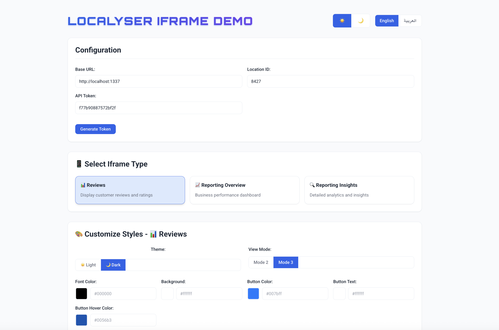
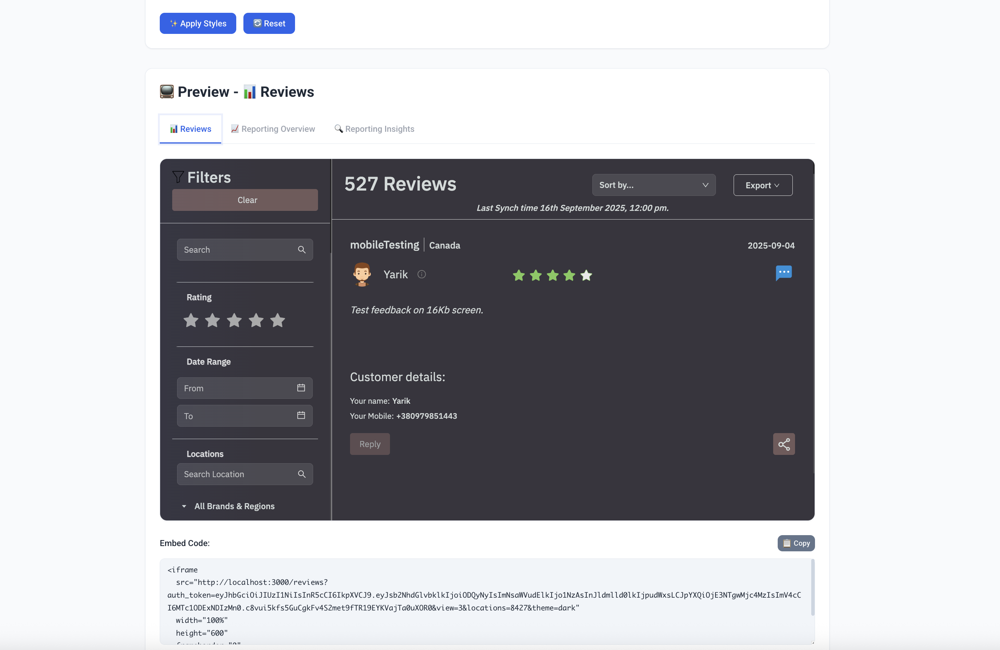

# 🎯 Localyser Iframe Admin Panel

A modern, multilingual admin panel for managing and customizing Localyser iframe integrations with real-time preview capabilities.


## ✨ Features

- 🎨 **Modern UI/UX** - Beautiful design with custom typography and animations
- 🌍 **Internationalization** - English and Arabic with full RTL support
- 🌗 **Theme System** - Light/dark modes with real-time customization
- ⚡ **Advanced Functionality** - Live preview, clipboard copy, API integration
- 📱 **Responsive Design** - Optimized for desktop, tablet, and mobile

## 🚀 Quick Start

### Installation

```bash
# Clone and install dependencies
git clone <repository-url>
cd wls_admin
npm install react-i18next i18next i18next-browser-languagedetector

# Optional: SCSS support (requires Node.js 18+)
npm install --save-dev sass

# Start development
npm start
```

### Usage

1. Enter API credentials (baseUrl, locationId, apiToken)
2. Click "Generate Token"
3. Select iframe type (Reviews/Overview/Insights)
4. Customize appearance with theme controls
5. Copy embed code for your website

## 📁 Project Structure

```
src/
├── components/           # React components
│   ├── ConfigurationSection.tsx
│   ├── RouteSelector.tsx
│   ├── ThemeCustomization.tsx
│   ├── IframePreview.tsx
│   ├── LanguageSelector.tsx
│   └── ThemeToggle.tsx
├── hooks/               # Custom hooks
├── services/            # API services
├── utils/               # Utility functions
├── types/               # TypeScript types
├── constants/           # App constants
├── i18n/               # Translations
└── styles/             # SCSS/CSS styles
```

## 🛠️ Technical Stack

- **Frontend**: React 18+, TypeScript, React Hooks
- **Styling**: SCSS/Sass, CSS Grid, Flexbox, CSS Custom Properties
- **i18n**: react-i18next, automatic language detection
- **Tools**: Create React App, ESLint, Prettier

## 🎨 Screenshots

### Main Interface - Light Theme



The admin panel features a clean, modern interface with:

- **Beautiful Header** with Orbitron font and gradient text effect
- **Theme Toggle** (☀️🌙) positioned on the left
- **Language Selector** (English/العربية) on the right
- **Configuration Section** for API credentials input
- **Route Selection** cards for different iframe types
- **Real-time Theme Customization** with color pickers
- **Professional Styling** with consistent spacing and typography

### Iframe Preview with Dark Theme



The preview section showcases:

- **Live Iframe Rendering** with real customer reviews
- **Dark Theme Integration** with professional color scheme
- **Copy-to-Clipboard** functionality with visual feedback
- **Embed Code Display** in monospace font
- **Responsive Layout** that adapts to different screen sizes
- **Multi-tab Navigation** for switching between route types

### Key UI Features Demonstrated

**🎨 Design System:**

- Custom Orbitron font for the main title
- Gradient text effects that change with themes
- Consistent button styling and hover effects
- Professional color palette with proper contrast

**🌍 Internationalization:**

- Seamless language switching between English and Arabic
- RTL layout support for Arabic users
- Translated interface elements and labels

**🌗 Theme System:**

- Light and dark mode toggle with smooth transitions
- Real-time color customization for iframe styling
- Persistent theme preferences across sessions

**📱 Responsive Design:**

- Adaptive layout that works on all device sizes
- Touch-friendly controls for mobile users
- Optimized spacing and typography for different screens

## 🌍 Internationalization

### Supported Languages

- **English** - Default language with full feature coverage
- **Arabic** - Complete translation with RTL layout support

### Adding New Languages

1. Create translation file: `src/i18n/locales/[lang].json`
2. Add to configuration: `src/i18n/config.ts`
3. Update language selector component

## 🎯 Customization

### Theme Colors

Customize in `src/styles/_variables.scss`:

```scss
$primary-color: #your-color;
$dark-background-primary: #your-dark-color;
```

### New Routes

Add to `src/constants/routes.ts`:

```typescript
newRoute: {
  path: '/new-path',
  title: '🆕 New Route',
  description: 'Route description',
  viewModes: ['1', '2', '3'],
  defaultViewMode: '1'
}
```

## 📱 Responsive Breakpoints

- **Mobile**: `< 640px` - Single column, stacked controls
- **Tablet**: `768px - 1024px` - Adaptive grid layout
- **Desktop**: `> 1024px` - Full multi-column layout

## 🔧 API Integration

### Required Configuration

```typescript
{
  baseUrl: "http://localhost:1337",    # API endpoint
  locationId: "your-location-id",      # Location identifier
  apiToken: "your-api-token"           # Authentication token
}
```

### Supported Routes

- `/reviews` - Customer reviews and ratings
- `/reporting/overview` - Business dashboard
- `/reporting/insights` - Detailed analytics

## 🚀 Deployment

### Production Build

```bash
npm run build
```

### Environment Variables

```env
REACT_APP_API_BASE_URL=https://your-api.com
REACT_APP_DEFAULT_LOCATION_ID=default-location
```

## 🔒 Security Features

- HTTPS API communication in production
- Required API tokens for iframe generation
- Sandboxed iframe with controlled permissions
- No sensitive data in localStorage

## 📊 Performance

- **Bundle Size**: ~350KB gzipped total
- **Code Splitting**: Lazy loading of components
- **Optimization**: Tree shaking and minification
- **Caching**: Browser caching for static assets

## 🤝 Contributing

1. Fork the repository
2. Create feature branch: `git checkout -b feature/name`
3. Make changes with proper TypeScript and i18n support
4. Test in both themes and languages
5. Submit pull request

## 📝 License

MIT License - see [LICENSE](LICENSE) for details.

## 🙏 Acknowledgments

- React Team for the framework
- i18next for internationalization
- Google Fonts (Orbitron & Roboto)
- Sass team for CSS preprocessing

---

**Built with ❤️ using React, TypeScript, and SCSS**
